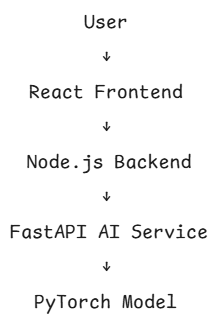

# Deepfake Detection System

An end-to-end AI platform that detects deepfake images using deep learning.  
The system uses a **microservice architecture** with a React frontend, Node.js backend, and a FastAPI AI inference service powered by PyTorch.

---

## 🚀 Features
- Deepfake image detection using a CNN model
- Image upload interface with prediction results
- Confidence score for predictions
- Microservice architecture
- Dockerized deployment

---

## 🧠 Architecture

Flow:

User → React Frontend → Node.js Backend → FastAPI AI Service → PyTorch Model

---

## 🛠 Tech Stack

| Layer | Technology |
|------|-------------|
| Frontend | React |
| Backend | Node.js, Express |
| AI Service | FastAPI, PyTorch |
| DevOps | Docker, Docker Compose |
| Computer Vision | OpenCV |

---

## 📁 Project Structure

